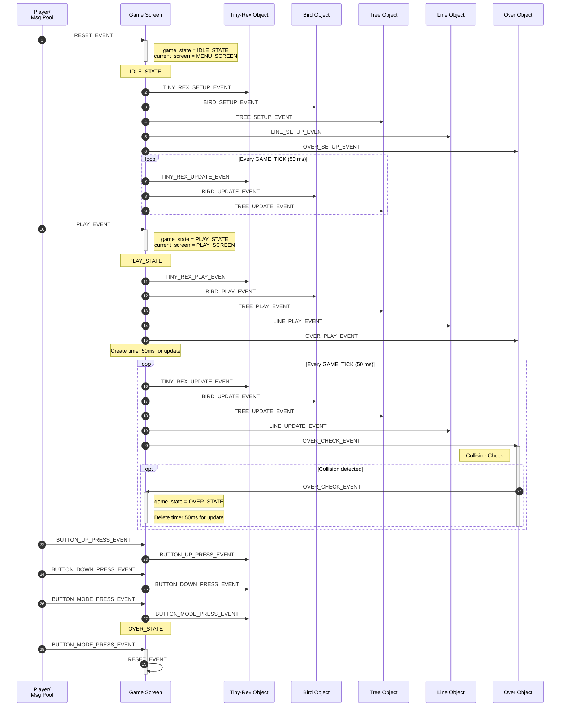
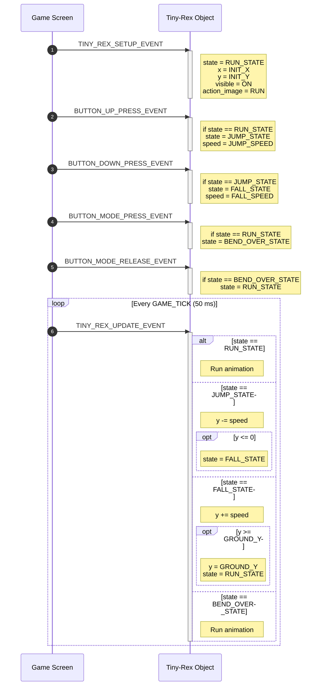

# Tiny-Rex - Game built on AK Embedded Base Kit

<center>
</center>

<hr>

## Gameplay Demo

<div align="center">
  <video src="https://github.com/user-attachments/assets/1f219060-ba05-4864-b85f-053c3afea595" controls width="480"></video>
</div>

## Documentation

| File | Description |
|---|---|
| [README.md](README.md) | Main project overview, hardware information, gameplay rules, and object descriptions. |
| [docs/01-guide-getting-started.md](docs/01-guide-getting-started.md) | Game programming getting started guide. |
| [docs/02-guide-coding-rules.md](docs/02-guide-coding-rules.md) | Some rules for coding game. |
| [docs/03-design-sequence-object.md](docs/03-design-sequence-object.md) | Runtime sequence diagrams for gameplay objects: Gunner, Bullet, Zombie, Car, Bang, Tombstone, and Border. |
| [docs/04-design-sequence-runtime.md](docs/04-design-sequence-runtime.md) | Runtime signal-processing flow for button input, AK task messages, timers, game-loop ticks, object updates, and Mermaid sequence diagrams. |

## Introduction

### Hardware
- This kit integrates 1.54" Oled LCD, 3 push buttons, and 1 buzzer, which would be sufficient to create a small video game with an event driven paradigm.
- It also includes RS485, Qwiic Connect System, and Grove Ecosystems, suitable for prototyping other practical applications in embedded systems.

[](<https://epcb.vn/products/ak-embedded-base-kit-lap-trinh-nhung-vi-dieu-khien-mcu>)

[AK base kit's schematic](/hardware/schematic/schematic-ak-embedded-base-kit-version-3.pdf)

[](<https://epcb.vn/products/ak-embedded-base-kit-lap-trinh-nhung-vi-dieu-khien-mcu>)

[](https://epcb.vn/products/ak-embedded-base-kit-lap-trinh-nhung-vi-dieu-khien-mcu)

## Memory map

AK base kit uses the following memory map to run its application code

- [ 0x08000000 ] : **Boot** [[Tiny-Rex-boot.bin]](https://github.com/ak-embedded-software/ak-base-kit-stm32l151/blob/main/hardware/bin/Tiny-Rex-boot.bin)
- [ 0x08002000 ] : **BSF** [ Memory for data sharing between Boot and Application ]
- [ 0x08003000 ] : **Application** [[Tiny-Rex-application.bin]](https://github.com/ak-embedded-software/ak-base-kit-stm32l151/blob/main/hardware/bin/Tiny-Rex-application.bin)                                             |

>**Note:** After loading the boot and application firmware, you can use [AK - Flash](https://github.com/ak-embedded-software/ak-flash), a CLI to work with the AK base kit, to load the application directly through the kit's USB port. Once installed, the following command will flash user's defined code into the kit's application's memory region.

```sh
ak_flash /dev/ttyUSB0 Tiny-Rex-application.bin 0x08003000
```


## Development Environment

To ensure a consistent and reproducible build environment, the project is developed using a Docker-based toolchain setup instead of local installation.

### Toolchain in Docker

The Docker image includes:

- GCC ARM Embedded toolchain (arm-none-eabi-gcc)
- GDB multiarch debugger
- Build tools (make)
- Git for source control
- Ak-Flash utility

## Build Workflow

```bash
# Build Docker image
docker build -t tiny-rex-game .

# Run container with mounted source code
docker run -it --rm \
    -v $(pwd):/workspace/source \
    --privileged \
    -w /workspace/source \
    tiny-rex-game
```

## Using Dev Container
You can also use a VSCode Dev Container to build and work on this project without installing toolchains locally.
- Build and run container
```bash
Open pallet (Ctrl+Shift+P) -> dev Containers: Reopen in Container
```

# Build project
```bash
make
```

# Flash firmware via st-link
```bash
make flash
```

# Flash firmware via ak-flash
```bash
make flash dev=dev/ttyUSB0
```

## UI Design

- [Lopaka.app](https://lopaka.app/) to create and preview screen layouts.
- [image2cpp](https://javl.github.io/image2cpp/) to scale the image to the exact display size and export it as a bitmap array for the embedded firmware.

## Debug flow
For a step-by-step debugging guide, see:
[Debug Guideline](./debug-guiline.md)
## Basic Game Sequence Logic



## Tiny-Rex Object Sequence



## Contact & Support

<p style="font-size: 20px;"><strong>TRUONG VAN VU</strong> - Embedded Software Enginneer</p>

``` Note
Thank you for visiting this repository.
If you have any questions, suggestions, or feedback about this project or firmware development, feel free to contact me directly.
```

<a href="https://github.com/truongvanvuembedded">
  
</a>

<a href="https://www.linkedin.com/in/vu-truong-van-1b9291271/">
  
</a>
