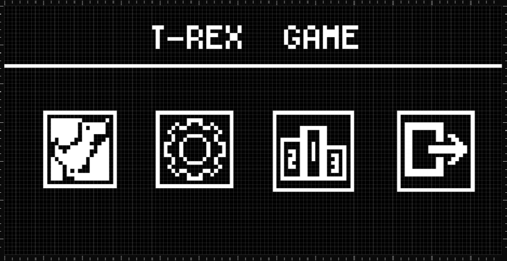
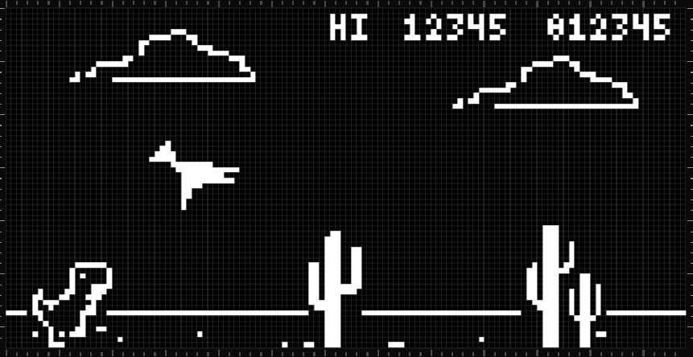

# Tiny-Rex - Game built on AK Embedded Base Kit


## Gameplay Demo

<div align="center">
  <video controls width="480">
    <source src="https://github.com/user-attachments/assets/aeda37a9-95ff-4896-bd56-b53e5ca4aa56" type="video/mp4">
  </video>
</div>

## Documentation

| File | Description |
|---|---|
| [README.md](README.md) | Main project overview, hardware information, gameplay rules, and object descriptions. |
| [resource/guide/01-guide-getting-started.md](resource/guide/01-guide-getting-started.md) | Game programming getting started guide. |
| [resource/guide/02-guide-coding-rules.md](resource/guide/02-guide-coding-rules.md) | Some rules for coding game. |
| [resource/guide/03-design-sequence-object.md](resource/guide/03-design-sequence-object.md) | Runtime sequence diagrams for gameplay objects: T-Rex, Obstacle and Horizon |
| [Resource/guide/05-guide-development-environment.md](resource/guide/05-guide-development-environment.md) | Guide for instruction debug kit using st-link with vscode + ArmCortex_Debug (Externsion) |
| [Resource/guide/06-guide-debug.md](resource/guide/06-guide-debug.md) | Guide for instruction debug kit using st-link with vscode + ArmCortex_Debug (Externsion) |


## Introduction

T-Rex game is an action survival game built on top of the AK Embedded Base Kit hands-on platform for embedded programming enthusiasts to explore event-driven design in depth. While building and playing T-Rex, you put the following core concepts of modern embedded engineering into practice:

- **System design:** Modelling complex logic flows with UML.
- **Process management:** Coordinating cooperative Tasks and scheduling them efficiently.
- **Communication:** Using Signals, Timers, and Messages to react in real time.
- **Control logic:** Building robust state machines for the player with obstacle in game.

### I. Hardware

- Integrates a 1.54" OLED display, 3 push buttons, and 1 buzzer, sufficient to create a small video game with an event-driven paradigm.
- Includes RS485, Qwiic Connect System, and Grove Ecosystems, suitable for prototyping other practical applications in embedded systems.

<p align="center">
  <a href="https://epcb.vn/products/ak-embedded-base-kit-lap-trinh-nhung-vi-dieu-khien-mcu">
    
  </a>
</p>

**Schematic:** [AK Base Kit Schematic](hardware/schematic/schematic-ak-embedded-base-kit-version-3.pdf)

**MCU Overview:**

```text
SoC Name : STM32L151CBT6
RAM      : 16 KB

Flash Partitions Layout
----------------------
[ 0x08000000 - 0x08001FFF ] : Bootloader Partition (8 KB)
=> AK Bootloader

[ 0x08002000 - 0x08002FFF ] : BSF Shared Partition (4 KB)
=> Used for data sharing between Bootloader and Application

[ 0x08003000 - 0x0801FFFF ] : Application Partition (116 KB)
=> T-Rex firmware
```

**MCU Naming Convention:**

| Part | Meaning |
|---|---|
| `STM32` | STMicroelectronics 32-bit MCU family. |
| `L` | Low-power series. |
| `151` | STM32L151 product line. |
| `C` | 48-pin package. |
| `B` | 128 KB Flash memory. |
| `T` | LQFP package. |
| `6` | Industrial temperature grade. |

<p align="center">
  <a href="https://epcb.vn/products/ak-embedded-base-kit-lap-trinh-nhung-vi-dieu-khien-mcu">
    
  </a>
  <a href="https://epcb.vn/products/ak-embedded-base-kit-lap-trinh-nhung-vi-dieu-khien-mcu">
    
  </a>
</p>

### II. Game Description and Objects
The following section describes the gameplay and core mechanics of **"Zomwar"**. It serves as a reference for ongoing game design and firmware development.

<table align="center">
  <tr>
    <td align="center"></td>
  </tr>
</table>
<p align="center"><strong><em>Figure 3:</em></strong> Menu screen</p>

The game opens on the **Main Menu**, which offers the following options:

- **Play:** Start a new match.
- **Setting:** Configure name for save high score such as sound and character.
- **Rank:** View the top 5 player with highest score.
- **Exit:** Leave the menu and return to the idle screen.

<table align="center">
  <tr>
    <td align="center"></td>
  </tr>
</table>
<p align="center"><strong><em>Figure 4:</em></strong> Gameplay screen</p>

#### Objects in the Game:

| Bitmap | Object Name | Description |
| :---: | :--- |:--- |
|  | **Tiny-Rex** | The player character. The Tiny-Rex can move vertically by jumping or ducking to avoid obstacles. The player controls the Tiny-Rex using the **[Up]** **[Down]** and **[Mode]** buttons. |
|  | **Bird** | A flying obstacle that moves from the right side of the screen toward the Tiny-Rex. The player must duck or avoid the Bird to prevent a collision. |
|  | **Tree** | A ground obstacle that moves from the right side of the screen toward the Tiny-Rex. The player must jump over the Tree to avoid a collision. |
|  | **Line** | The ground line of the game. It continuously moves from right to left to create the scrolling background effect while the Tiny-Rex is running. |

### III. How to Play

- You control the **Tiny-Rex**. Use the **[Up]**, **[Down]**, and **[Mode]** buttons to avoid obstacles.
- Press the **[Up]** button to jump over **Trees**.
- Press the **[Down]** button while jumping to make the Tiny-Rex fall faster.
- Press the **[Mode]** button to duck and avoid **Birds**.
- **Trees** and **Birds** appear randomly from the right side of the screen and move toward the Tiny-Rex.
- Avoid collisions with obstacles to keep the game running.
- The game continues indefinitely until the Tiny-Rex collides with an obstacle.
- The game speed increases as the score reaches predefined thresholds, making the game progressively more challenging.

#### Game Mechanics:

- **Scoring:** The score increases continuously until Game Over, based on the distance traveled by the Tiny-Rex.
- **Difficulty:** Every **100 points (meters)**, the current score blinks and a sound is played to celebrate the player's progress. The game then increases the speed and adjusts the distance between obstacles.
- **Animation:** To keep the gameplay lively, the Tiny-Rex and obstacles use animation frames to create movement.
- **Game Over:** When the Tiny-Rex collides with an obstacle, the game state changes to **Game Over** and waits for the player to press any button before returning to the **Waiting** screen for restart new match.

### IV. Basic Game Sequence Logic

```mermaid
%%{init: {'theme':'base','themeVariables':{'fontSize':'18px','primaryColor':'#1565c0','primaryTextColor':'#ffffff','primaryBorderColor':'#0d47a1','lineColor':'#90a4ae','signalColor':'#ffc107','signalTextColor':'#ffc107','actorBkg':'#1565c0','actorBorder':'#0d47a1','actorTextColor':'#ffffff','actorLineColor':'#90caf9','noteBkgColor':'#fff59d','noteTextColor':'#000000','noteBorderColor':'#f57f17','activationBkgColor':'#66bb6a','activationBorderColor':'#2e7d32','sequenceNumberColor':'#ffffff','loopTextColor':'#ffc107','labelBoxBkgColor':'#37474f','labelBoxBorderColor':'#90a4ae','labelTextColor':'#ffffff'},'sequence':{'actorMargin':120,'messageFontSize':17,'noteFontSize':15,'actorFontSize':17,'boxMargin':15,'boxTextMargin':8,'noteMargin':12,'useMaxWidth':false}}}%%
sequenceDiagram
    autonumber

    participant Act as Player / Input
    participant Scr as Game Screen
    participant Rex as T-Rex
    participant Obs as Obstacle
    participant Hor as Horizon
    participant Score as Score

    %% ===== Idle Screen =====
    rect rgb(46, 11, 3)
            Note over Scr: IDLE
        Act->>Scr: POWER_ON / RESET
        activate Scr
        Note right of Scr: State = IDLE <br/> Screen = IDLE <br/> Arm timer for switch to WAITING
        deactivate Scr
    end

    %% ===== Waiting Screen =====
    rect rgb(56, 50, 4)
            Note over Scr: WAITING
        Act->>Scr: ANY BUTTON / TIME OUT
        activate Scr
        Note right of Scr: State = WAITING <br/> Screen = MENU
        deactivate Scr

            %% ===== Swich screen base on button input =====
        Act->>Scr: SETTING
        activate Scr
        Note right of Scr: Screen = SETTING
        deactivate Scr
        Act->>Scr: RANKING
        activate Scr
        Note right of Scr: Screen = RANKING
        deactivate Scr
        Act->>Scr: EXIT
        activate Scr
        Note right of Scr: Screen = IDLE
        deactivate Scr
    end

    %% ===== Playing Screen =====
    rect rgb(12, 40, 117)
            Note over Scr: PLAYING
        Act->>Scr: START
        activate Scr
        Note right of Scr: State = PLAYING <br/> Screen = PLAYING <br/> Arm timer for udpate screen
        deactivate Scr

        Scr->>Rex: TINY_REX_PLAY_EVENT
        Scr->>Obs: OBSTACLE_PLAY_EVENT
        Scr->>Hor: HORIZON_PLAY_EVENT

        loop UPDATE SCREEN
            Scr->>Obs: COLLISION_CHECK_EVENT
            Scr->>Rex: TINY_REX_MOVE_EVENT
            Scr->>Obs: OBSTACLE_MOVE_EVENT
            Scr->>Hor: HORIZON_MOVE_EVENT
            Scr->>Score: SCORE_UPDATE_EVENT
            activate Score
              Note over Score: Increase score
            alt Score exceed threshold
              Note over Score: Increase new score threshold
                Score->>Rex: TINY_REX_INC_SPEED_EVENT
                Score->>Obs: OBSTACLE_INC_SPEED_EVENT
                Score->>Hor: HORIZON_INC_SPEED_EVENT
            end
            deactivate Score
            alt Collision detected
                Obs->>Scr: GAME_OVER_EVENT
                        activate Scr
                Note right of Scr: State = Over <br/> Screen: Over <br/> Save score <br/> Delete udpate screen timer
                      deactivate Scr
            end
        end
        
            %% ===== Button handler =====
        Act->>Scr: BUTTON_UP_PRESS
            activate Scr
            Scr->>Rex: TINY_REX_JUMP_EVENT
            deactivate Scr
        Act->>Scr: BUTTON_DOWN_PRESS
            activate Scr
            Scr->>Rex: TINY_REX_FALL_EVENT
            deactivate Scr
        Act->>Scr: BUTTON_MOVE_PRESS
            activate Scr
            Scr->>Rex: TINY_REX_DUCK_EVENT
            deactivate Scr
    end

    %% ===== GameOver Screen =====
    rect rgb(11, 95, 66)
            Note over Scr: OVER
        Act->>Scr: ANY_BUTTON
        activate Scr
        Note right of Scr: State = WAITING <br/> Screen = WAITING
        deactivate Scr
    end
```


### IV. UI Design

- [Lopaka.app](https://lopaka.app/) to create and preview screen layouts.
- [image2cpp](https://javl.github.io/image2cpp/) to scale the image to the exact display size and export it as a bitmap array for the embedded firmware.

## Contact & Support

<p style="font-size: 20px;"><strong>TRUONG VAN VU</strong> - Embedded Software Enginneer</p>

``` Note
Thank you for visiting this repository.
If you have any questions, suggestions, or feedback about this project or firmware development, feel free to contact me directly.
```

<a href="https://github.com/truongvanvuembedded">
  
</a>

<a href="https://www.linkedin.com/in/vu-truong-van-1b9291271/">
  
</a>
