<h1 align="center">Coding rules and style guide</h1>

This document defines the naming conventions, code style, commit message format, and document naming conventions used in the project, along with instructions for installing and using `clang-format`. The goal is to make sure code contributed by team members stays consistent in form and easy to track through search tools, code review, and version control. These are the takeaways from finishing the Zomwar game � feel free to refer to them and apply whatever fits.

---

## Table of contents

- [I. Naming conventions](#i-naming-conventions)
  - [1. Folder](#1-folder)
  - [2. Source and header files](#2-source-and-header-files)
  - [3. Header guard](#3-header-guard)
  - [4. Macros and compile-time constants](#4-macros-and-compile-time-constants)
  - [5. Signal (enum values)](#5-signal-enum-values)
  - [6. Task ID](#6-task-id)
  - [7. Data types and typedef](#7-data-types-and-typedef)
  - [8. Functions](#8-functions)
  - [9. Variables](#9-variables)
- [II. Code style (clang-format)](#ii-code-style-clang-format)
- [III. Installing clang-format](#iii-installing-clang-format)
- [IV. Running clang-format](#iv-running-clang-format)
- [V. Commit message convention](#v-commit-message-convention)
- [VI. Document file naming convention](#vi-document-file-naming-convention)
- [VII. References](#vii-references)

---

## I. Naming conventions

The conventions below are drawn directly from the existing source code. You can follow these conventions to develop your coding so that tooling, search, and reviewers all work consistently.

**Case styles used in this document:**

| Style | Description | Example in project | Applied to |
|---|---|---|---|
| `lower_snake_case` | Lowercase letters, words separated by underscore `_` | `wave_warning_active`, `zw_game_score` | Variables, functions, typedefs, source file names, folder names |
| `UPPER_SNAKE_CASE` | Uppercase letters, words separated by underscore `_` | `BULLET_NUMBER`, `ZW_GAME_BORDER_SETUP`, `AC_TASK_DISPLAY_ID` | `#define` constants, signal enums, task IDs, macros |
| `kebab-case` | Lowercase letters, words separated by hyphen `-` | `02-guide-coding-rules.md` | Documentation file names under `docs/` |

### 1. Folder

Use `lower_snake_case` for folder names. Organize by feature (feature-based), not by file type.

```
application/sources/app/
  game/
    game_<game_name>/     # folder holding the source code of all objects of a game,
                          # e.g. game_zomwar
  screens/                # folder holding the source code of all display screens
  ...
```

### 2. Source and header files

Source and header files always carry a module prefix so you can identify the module right from the file name:

| Prefix | Meaning | Example |
|---|---|---|
| `scr_*` | Handler of a screen | `scr_game_zomwar.cpp`, `scr_game_over.h` |
| `zw_game_*` | Object belonging to the Zomwar game | `zw_game_bang.cpp`, `zw_game_border.h` |

Each game defines its own short prefix (for example `zw_game_*` for Zomwar) and applies it consistently to every file in that game's folder.

File extensions: `.h` for headers, `.cpp` for implementation (the project is built as C++).

### 3. Header guard

Use the pattern `__<FILE_NAME>_H__`, fully uppercased, matching the file name exactly:

```cpp
#ifndef __ZW_GAME_BANG_H__
#define __ZW_GAME_BANG_H__
...
#endif //__ZW_GAME_BANG_H__
```

### 4. Macros and compile-time constants

Use `UPPER_SNAKE_CASE` for names. Always wrap numeric values in parentheses to avoid errors when the macro gets expanded.

**Mandatory rule: a macro that belongs to an object MUST carry that object's name as a prefix.**

Pattern: `<OBJECT>_<PROPERTY>` or `<OBJECT>_<ACTION>` � the object always comes first. Reading the macro name tells you immediately which module it belongs to, and grepping by object name returns every constant of that module.

| Constant type | Correct form |
|---|---|
| Count | `ZOMBIE_NUMBER`, `BULLET_NUMBER`, `BANG_NUMBER` |
| Coordinate | `GUNNER_AXIS_X`, `CAR_AXIS_X` |
| Movement step | `GUNNER_STEP_AXIS_Y`, `BULLET_STEP_AXIS_X` |
| Bitmap size | `GUNNER_SIZE_BITMAP_X`, `BANG_SIZE_BITMAP_I_X` |
| Time / interval | `BORDER_WAVE_SCORE_INTERVAL`, `TOMBSTONE_SPAWN_INTERVAL` |
| Behavior / limit | `ZOMBIE_RISE_TICKS`, `ZOMBIE_SPEED_MAX`, `CAR_HIT_RANGE_Y` |

Examples done right:

```cpp
// zw_game_bullet.h
#define BULLET_NUMBER              (15)
#define BULLET_MAX_AXIS_X          (128)
#define BULLET_STEP_AXIS_X         (3)
#define BULLET_SIZE_BITMAP_X       (5)
#define BULLET_SIZE_BITMAP_Y       (5)

// zw_game_gunner.h
#define GUNNER_STEP_AXIS_Y         (10)
#define GUNNER_AXIS_X              (14)
#define GUNNER_AXIS_Y              (52)
#define GUNNER_AXIS_Y_MIN          (12)
#define GUNNER_AXIS_Y_MAX          (52)
#define GUNNER_SIZE_BITMAP_X       (25)
#define GUNNER_SIZE_BITMAP_Y       (10)

// zw_game_border.h
#define BORDER_WAVE_SCORE_INTERVAL    (200)
#define BORDER_WARNING_BLINK_DURATION (30)
#define BORDER_WARNING_BLINK_RATE     (3)
#define BORDER_SIZE_BITMAP_WARNING_X  (16)
#define BORDER_SIZE_BITMAP_WARNING_Y  (14)
```

**Exception � system / project level macros:** macros belonging to the whole game (not tied to any specific object) use the project prefix `ZW_GAME_*`:

```cpp
#define ZW_GAME_TIME_TICK_INTERVAL (100)
#define ZW_GAME_TIME_EXIT_INTERVAL (3000)
```

Group related constants in the right module header (`zw_game_bullet.h` holds bullet constants, `zw_game_gunner.h` holds gunner constants, and so on). Never leave magic numbers scattered across `.cpp` files.

### 5. Signal (enum values)

Signals are the **public contract** between tasks. Always use the full prefix � no abbreviations, not in comments, documentation, or sequence diagrams.

| Pattern | Applied to | Example |
|---|---|---|
| `<GAME>_<OBJECT>_<ACTION>` | Per-game signal | `ZW_GAME_BORDER_CHECK_GAME_OVER` |

Declare each task's signal set in `app.h` as its own enum block, anchored to `ZW_GAME_DEFINE_SIG` (or `AK_USER_DEFINE_SIG` for the framework group):

```cpp
/*****************************************************************************/
/*  Zomwar game 'BORDER' task define
 */
/*****************************************************************************/
enum {
    ZW_GAME_BORDER_SETUP = ZW_GAME_DEFINE_SIG,
    ZW_GAME_BORDER_CHECK_GAME_OVER,
    ZW_GAME_BORDER_CHECK_WAVE,
    ZW_GAME_BORDER_LEVEL_UP,
    ZW_GAME_BORDER_RESET,
};
```

### 6. Task ID

Use the pattern `<PREFIX>_<NAME>_ID`, fully uppercased, registered in `task_list.h`:

```cpp
AC_TASK_DISPLAY_ID
ZW_GAME_GUNNER_ID
ZW_GAME_BORDER_ID
```

The corresponding handler in `task_list.cpp` keeps the same name, replacing the `_ID` suffix with `_handle` and lowercased:

```cpp
{ZW_GAME_BORDER_ID, TASK_PRI_LEVEL_4, zw_game_border_handle},
```

### 7. Data types and typedef

Use `lower_snake_case` with the `_t` suffix. The struct stays anonymous; the typedef is the public name:

```cpp
typedef struct
{
    uint8_t x;
    uint8_t y;
    uint8_t action_image;
    bool    visible;
} zw_game_gunner_t;
```

Types provided by the framework follow the same pattern (`ak_msg_t`, `view_screen_t`).

### 8. Functions

Use `lower_snake_case` with the module name as prefix, so that grepping the prefix returns every entry point of that module:

```cpp
void   zw_game_border_handle(ak_msg_t* msg);
void   zw_game_bang_spawn(int16_t x, uint8_t y);
void   zw_game_zombie_spawn_from_tombstone(uint8_t i, int16_t x, uint8_t y);
int8_t zw_game_car_find_nearest(uint8_t zy);
```

### 9. Variables

Use `lower_snake_case`. Do not start names with an underscore.

- **Globals shared between modules:** declare `extern` in the header, define exactly once in the `.cpp` of the owning module.

  ```cpp
  // zw_game_border.h
  extern uint16_t zw_game_score;
  extern uint8_t  wave_level;
  extern bool     wave_warning_active;
  ```

- **Module-internal variables:** declare `static` in the `.cpp`.

  ```cpp
  // scr_game_zomwar.cpp
  static uint8_t zw_game_state;
  static uint8_t gunner_dir = GUNNER_DIR_NONE;
  ```

- **Local variables:** short, describe the role accurately. Loop counters can use `i`, `j`, `k` when the scope is clear.

State belonging to a task's object should carry that object's name (`gunner.y`, `bang[i].visible`, `wave_warning_timer`); do not stash cross-cutting state inside another module's `.cpp`.

---

## II. Code style (clang-format)

The repo already includes a `.clang-format` file at the root, shown here for reference:

```yaml
Language: Cpp
BasedOnStyle: LLVM
UseTab: ForIndentation
IndentWidth: 4
TabWidth: 4
ColumnLimit: 0
BreakBeforeBraces: Allman
AllowShortIfStatementsOnASingleLine: false
AllowShortFunctionsOnASingleLine: None
AllowShortBlocksOnASingleLine: false
AllowShortCaseLabelsOnASingleLine: false
PointerAlignment: Left
SpaceBeforeParens: ControlStatements
IndentCaseLabels: false
SortIncludes: false
```

What the non-default settings do:

| Setting | Effect |
|---|---|
| `UseTab: ForIndentation`, `IndentWidth: 4`, `TabWidth: 4` | Tabs are used only for indentation, not alignment. One tab equals 4 columns. |
| `ColumnLimit: 0` | No automatic line wrapping. The author decides where to break a line. |
| `BreakBeforeBraces: Allman` | The `{` always sits on its own line � applies to `if`, `for`, and function bodies. |
| `AllowShort*OnASingleLine: false` | One statement per line, even for short `if` statements or empty functions. |
| `PointerAlignment: Left` | Write `int* p`, not `int *p`. |
| `SpaceBeforeParens: ControlStatements` | `if (x)`, `for (...)` have a space; `func(x)` does not. |
| `IndentCaseLabels: false` | `case` labels sit at the same indent level as `switch`. |
| `SortIncludes: false` | Include order is meaningful (BSP � framework � project) and must not be sorted automatically. |

---

## III. Installing clang-format

Instructions for Linux (Ubuntu / Debian).

Install:

```bash
sudo apt update
sudo apt install clang-format
```

<table align="center">
  <tr>
    <td align="center">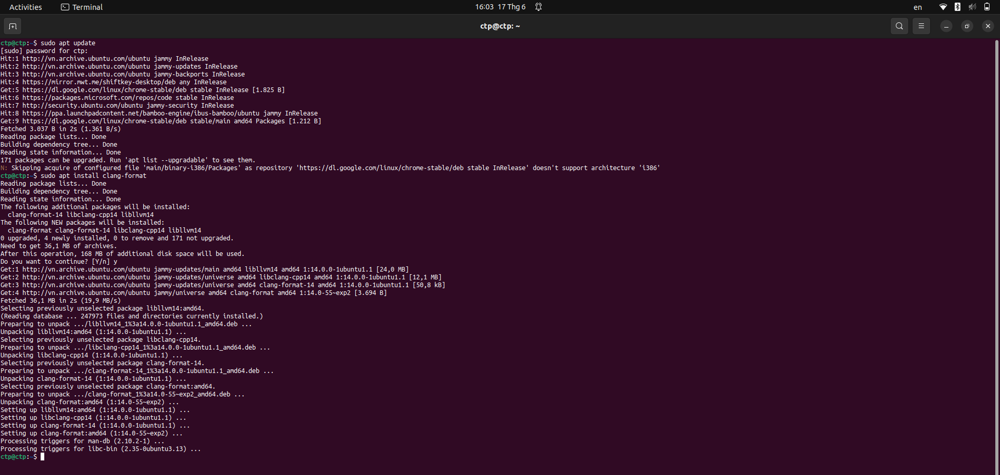</td>
  </tr>
</table>
<p align="center"><strong><em>Figure 1:</em></strong> Installing clang-format</p>

Verify the install:

```bash
clang-format --version
```

Expected output (version number may differ):

```
Ubuntu clang-format version 14.x.x
```

<table align="center">
  <tr>
    <td align="center">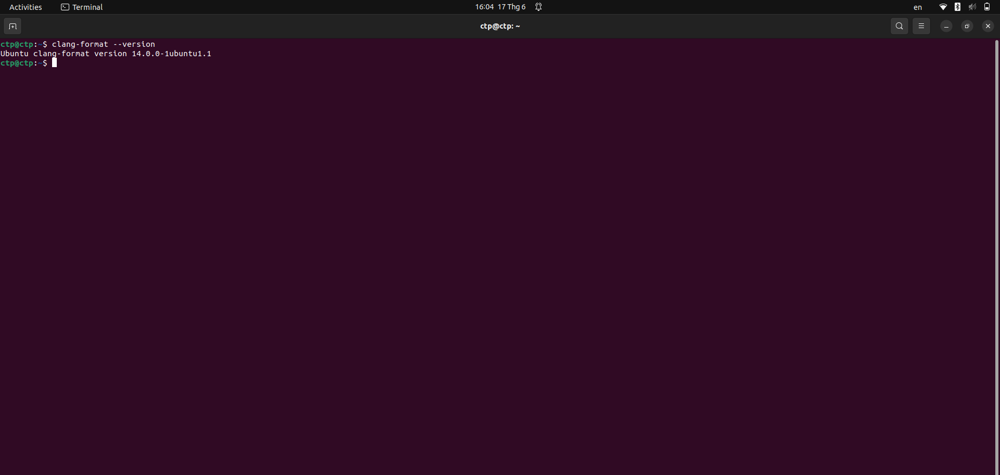</td>
  </tr>
</table>
<p align="center"><strong><em>Figure 2:</em></strong> Checking the clang-format version</p>

---

## IV. Running clang-format

### 1. Running from the command line

Format a single file in place:

```bash
clang-format -i application/sources/app/game/game_zomwar/zw_game_bullet.cpp
```

<table align="center">
  <tr>
    <td align="center">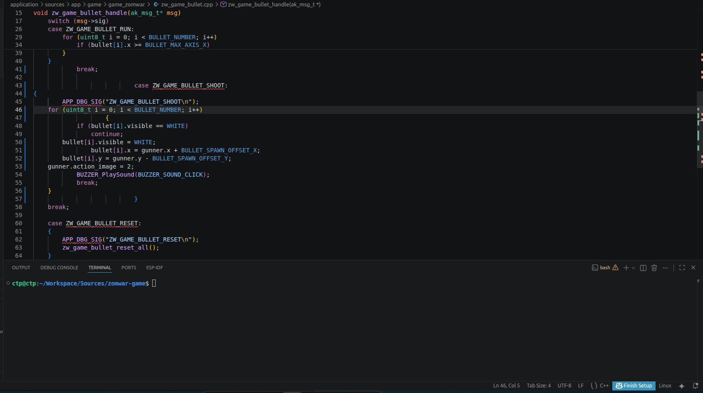</td>
    <td align="center">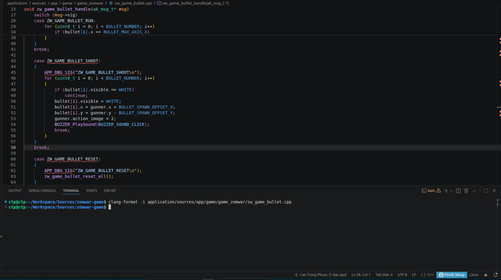</td>
  </tr>
  <tr>
    <td align="center"><strong><em>Before format</em></strong></td>
    <td align="center"><strong><em>After format</em></strong></td>
  </tr>
</table>
<p align="center"><strong><em>Figure 3:</em></strong> Comparison before and after formatting a single file</p>

Format every source and header file under `application/sources/app`:

```bash
find application/sources/app -type f \( -name "*.cpp" -o -name "*.h" \) \
    -not -path "*/libraries/*" \
    -exec clang-format -i {} +
```

<table align="center">
  <tr>
    <td align="center">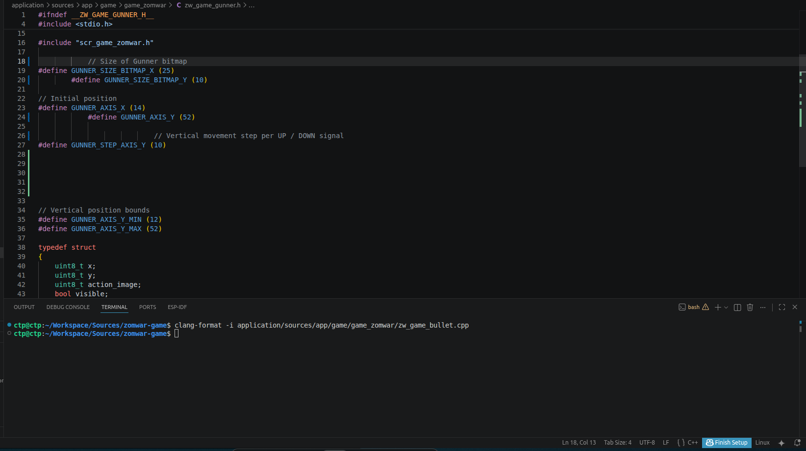</td>
    <td align="center">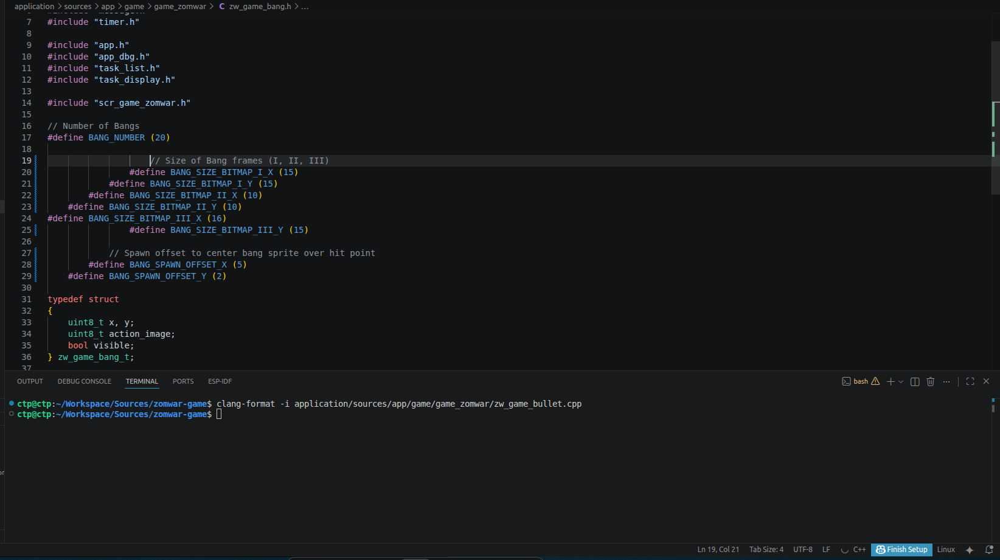</td>
  </tr>
  <tr>
    <td align="center"><strong><em>Before format (1)</em></strong></td>
    <td align="center"><strong><em>Before format (2)</em></strong></td>
  </tr>
</table>
<p align="center"><strong><em>Figure 4:</em></strong> Source code state before bulk formatting</p>

<table align="center">
  <tr>
    <td align="center">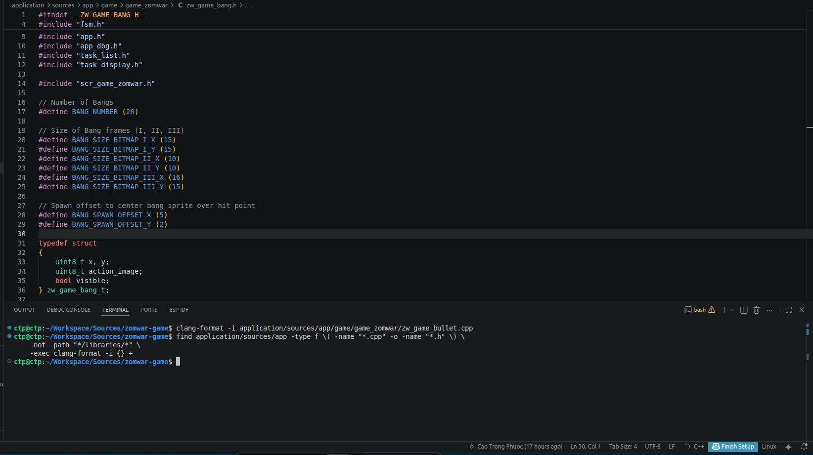</td>
    <td align="center">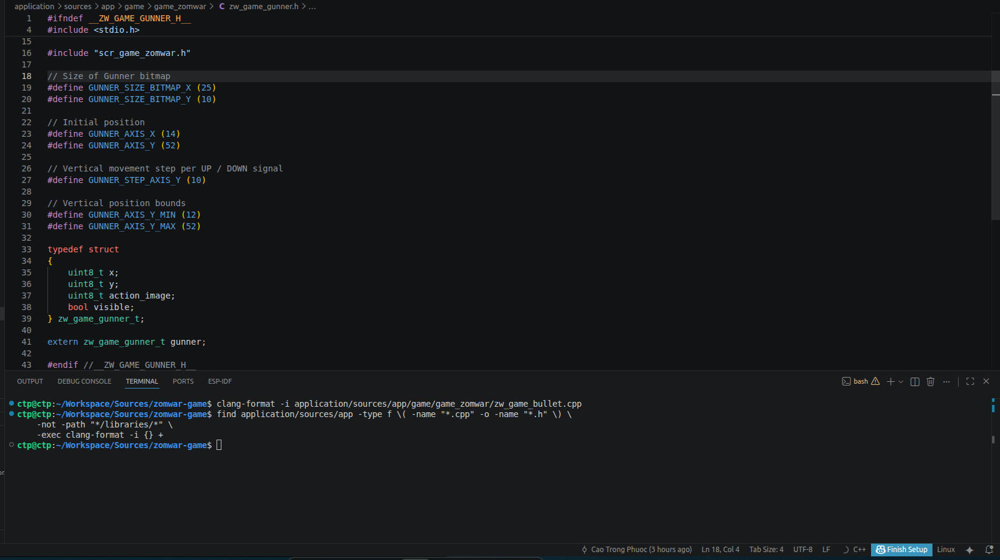</td>
  </tr>
  <tr>
    <td align="center"><strong><em>After format (1)</em></strong></td>
    <td align="center"><strong><em>After format (2)</em></strong></td>
  </tr>
</table>
<p align="center"><strong><em>Figure 5:</em></strong> Source code state after bulk formatting</p>

### 2. VSCode integration

**Step 1.** Install the **C/C++** extension (Microsoft) � it ships with `clang-format` and automatically picks up the `.clang-format` file in the repo.

<table align="center">
  <tr>
    <td align="center">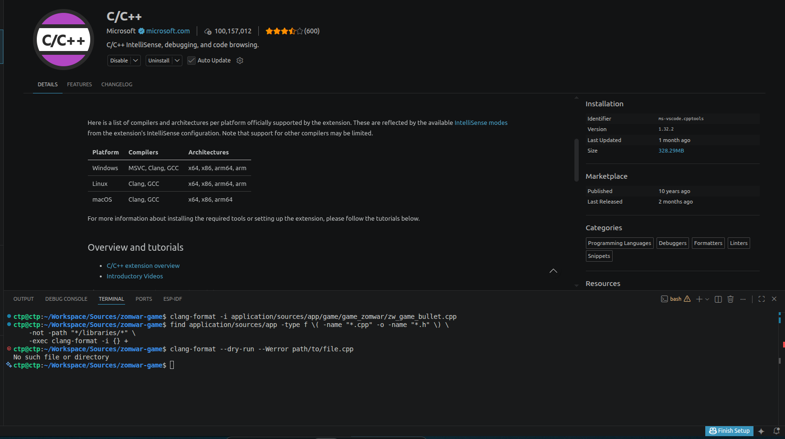</td>
  </tr>
</table>
<p align="center"><strong><em>Figure 6:</em></strong> Installing the C/C++ extension</p>

**Step 2.** Open the workspace settings (`.vscode/settings.json`) and add the following config:

```json
{
    "editor.formatOnSave": true,
    "editor.defaultFormatter": "ms-vscode.cpptools",
    "C_Cpp.clang_format_style": "file",
    "C_Cpp.clang_format_fallbackStyle": "LLVM"
}
```

<table align="center">
  <tr>
    <td align="center">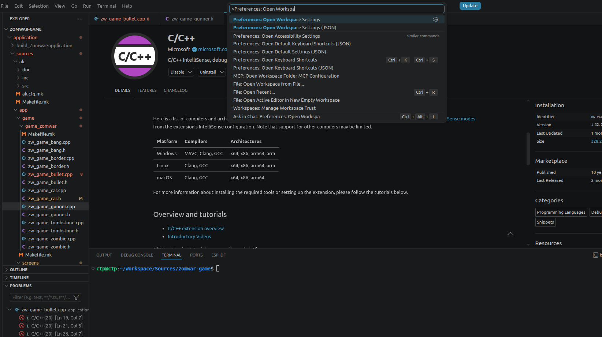</td>
  </tr>
</table>
<p align="center"><strong><em>Figure 7:</em></strong> Opening the workspace settings file</p>

<table align="center">
  <tr>
    <td align="center">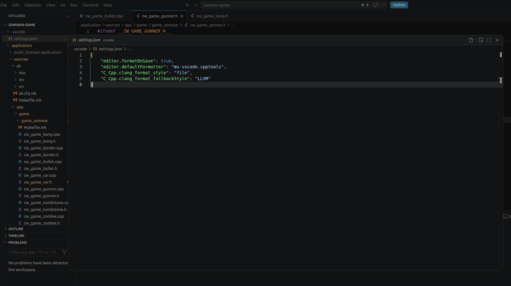</td>
  </tr>
</table>
<p align="center"><strong><em>Figure 8:</em></strong> The JSON configuration contents</p>

**Step 3.** Format the current file using the shortcut <kbd>Ctrl</kbd>+<kbd>Shift</kbd>+<kbd>I</kbd> (Windows / Linux).

<table align="center">
  <tr>
    <td align="center">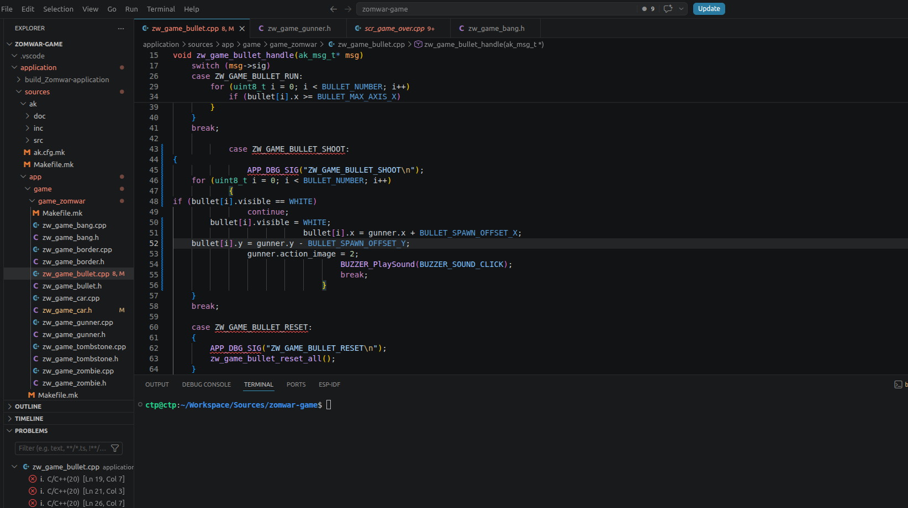</td>
    <td align="center">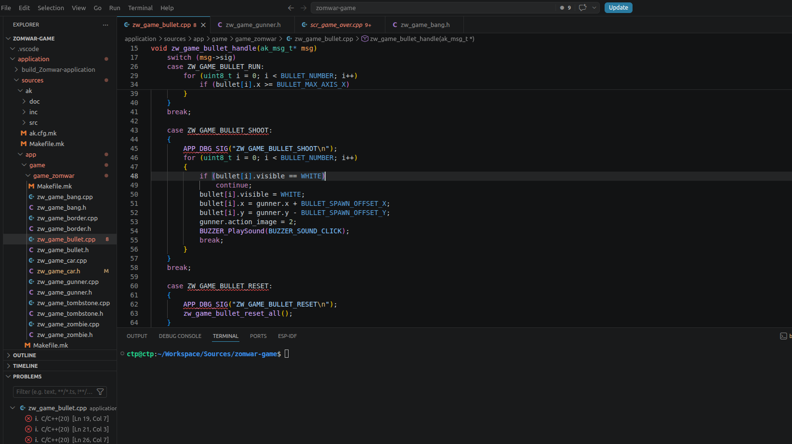</td>
  </tr>
  <tr>
    <td align="center"><strong><em>Before format</em></strong></td>
    <td align="center"><strong><em>After format with <kbd>Ctrl</kbd>+<kbd>Shift</kbd>+<kbd>I</kbd></em></strong></td>
  </tr>
</table>
<p align="center"><strong><em>Figure 9:</em></strong> Comparison before and after formatting with the shortcut</p>

**Step 4.** Turn on `format On Save` so the editor formats the file on every save, making sure no code with stale formatting gets committed.

<table align="center">
  <tr>
    <td align="center">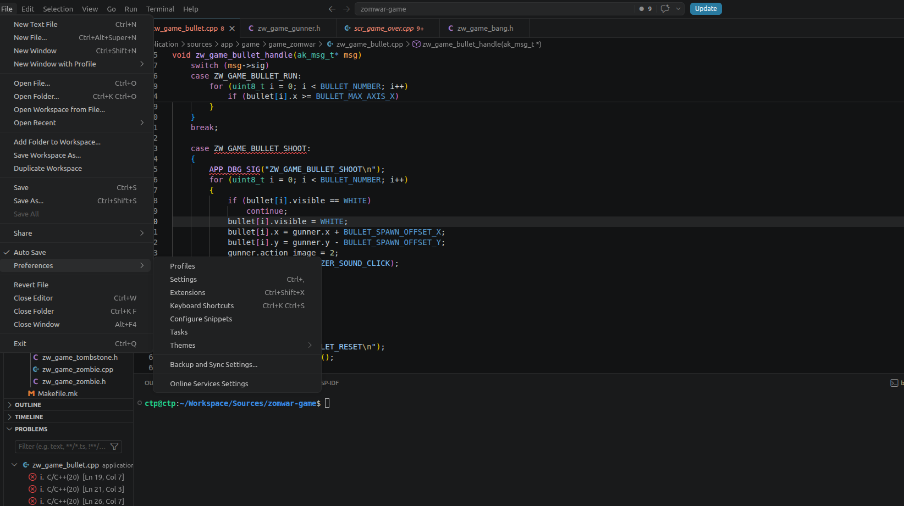</td>
  </tr>
</table>
<p align="center"><strong><em>Figure 10:</em></strong> Opening VSCode settings</p>

<table align="center">
  <tr>
    <td align="center">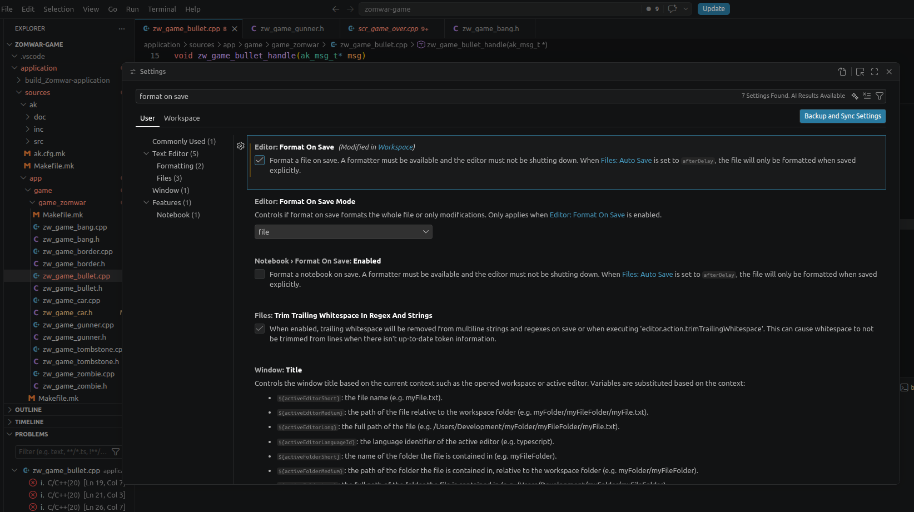</td>
  </tr>
</table>
<p align="center"><strong><em>Figure 11:</em></strong> Enabling the Format On Save option</p>

<table align="center">
  <tr>
    <td align="center">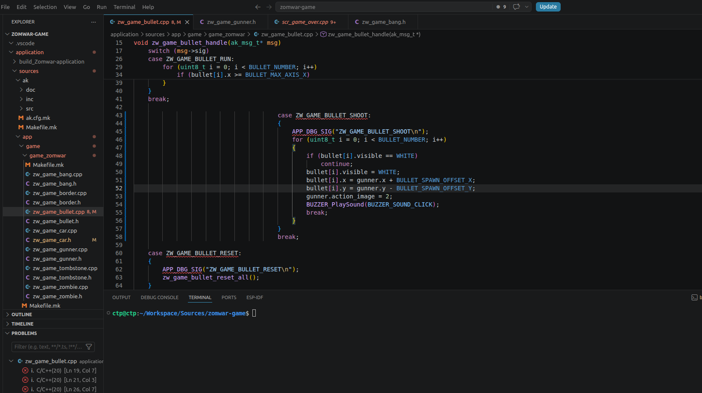</td>
    <td align="center">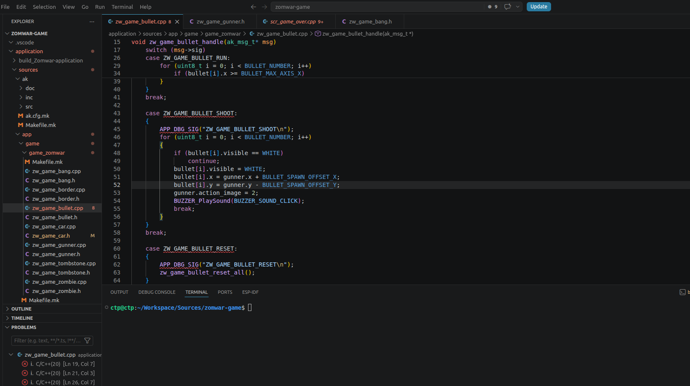</td>
  </tr>
  <tr>
    <td align="center"><strong><em>Before format</em></strong></td>
    <td align="center"><strong><em>After format (automatic on save)</em></strong></td>
  </tr>
</table>
<p align="center"><strong><em>Figure 12:</em></strong> Comparison before and after automatic formatting on save</p>

---

## V. Commit message convention

Every commit must follow the format `[ACTION] short description` so the git history stays easy to read and easy to filter.

### 1. Workflow

```bash
git add .                                     # stage every change
git commit -m "[ACTION] short description"    # tag is mandatory, keep description short
git push                                      # push to remote
```

When you only need to stage specific files, replace `git add .` with `git add <path>` to avoid committing junk files by mistake.

### 2. Action tags

| Tag | When to use |
|---|---|
| `[ADD]` | Adding a new file, feature, asset, or document |
| `[UPDATE]` | Updating existing code � refactor, rename, tweak logic, bump version |
| `[FIX]` | Fixing an existing bug, build error, or formatting error |
| `[REMOVE]` | Removing a file, feature, or dead code |
| `[DOC]` | Documentation-only changes (`docs/`, `README.md`, large comment blocks) |
| `[MERGE]` | Branch merges (usually tool-generated, do not hand-edit) |

### 3. Description style

- Tag fully uppercased inside `[]`, followed by exactly one space, then the description.
- Description in lowercase, imperative mood (`add`, `fix`, `rename`, `move`...), no trailing period.
- Keep the length around 70 characters � if longer, shorten it or move the details into the commit body.
- When the change touches a specific module / signal / file, name it directly so the history is easy to grep.

### 4. Good examples

```text
[ADD] tombstone object sequence
[ADD] mermaid border sequence diagram
[UPDATE] rename Border signals to ZW_GAME_BORDER_*
[UPDATE] split Bang narrative into Setup/Per-tick/Reset
[UPDATE] enlarge runtime mermaid font size
[FIX] off-by-one in zombie zigzag clamp
[REMOVE] unused gunner_dir static in scr_idle
[DOC] coding rules and clang-format setup guide
```

### 5. Examples to avoid

```text
update                          # missing tag
[update] fix something          # tag must be uppercase
[ADD] Added new file.           # no past tense and no trailing period
[FIX] fix bug                   # too vague, which bug?
[ADD] zw_game_border.cpp + zw_game_zombie.cpp + scr_game_zomwar.cpp ... # too long, group by topic
```

---

## VI. Document file naming convention

Files in `docs/` follow the format `<NN>-<category>-<topic>.md`:

| Component | Convention | Example |
|---|---|---|
| `NN` | A 2-digit sequence number, starting from `01`. Reflects reading order � guides come first, design docs come after. | `01`, `02`, `03` |
| `category` | Document category. Only use predefined values; do not add new categories. | `guide`, `design` |
| `topic` | Main topic, written in `kebab-case` (lowercase, words separated by `-`). | `getting-started`, `coding-rules`, `sequence-object` |

Categories currently in use:

| Category | Purpose | Typical content |
|---|---|---|
| `guide` | Workflow, setup, and process guides for contributors | Getting started, coding rules |
| `design` | Describes architecture and runtime behavior of the system | Sequence diagrams |

Example of files currently in the repo:

```
docs/
├── 01-guide-getting-started.md
├── 02-guide-coding-rules.md
├── 03-design-sequence-object.md
└── 04-design-sequence-runtime.md
```

A few important notes:

- Documentation files (`.md`) use `kebab-case` (hyphens). Source files and folders use `snake_case` (underscores). The difference is intentional: `kebab-case` is the standard convention for Markdown slugs and URLs.
- Images that go with a document live under `resources/images/<topic_dir>/`, where `<topic_dir>` follows the folder convention (snake_case). For example: `resources/images/getting_started/`.
- When adding a new document, continue the sequence number from the current maximum and keep the same category together to preserve a natural reading order.
- Renaming a documentation file must be done with `git mv` so that the rename history is tracked properly.

---

## VII. References

- [Naming convention � Multi-word identifiers (Wikipedia)](https://en.wikipedia.org/wiki/Naming_convention_(programming)#Multiple-word_identifiers) � definitions of `snake_case`, `SCREAMING_SNAKE_CASE`, and `kebab-case` used in Sections I and VI.
- [Clang-Format � Configurable Format Style Options](https://clang.llvm.org/docs/ClangFormatStyleOptions.html#configurable-format-style-options) � describes every key in the `.clang-format` file from Section II.
- [LLVM Coding Standards � Source Code Formatting](https://llvm.org/docs/CodingStandards.html#source-code-formatting) � base style inherited via `BasedOnStyle: LLVM` in Section II.
- [Pro Git � Recording Changes to the Repository](https://git-scm.com/book/en/v2/Git-Basics-Recording-Changes-to-the-Repository) � the `git add` / `git commit` / `git push` workflow used in Section V.

---

## Contact & Support

<p style="font-size: 20px;"><strong>Cao Trong Phuoc</strong> - Software Engineer - Embedded Systems</p>

```
Thanks for stopping by this repository.
If you have any questions, suggestions, or feedback about this project
or about firmware development in general, feel free to reach out to me directly.
```

<a href="https://github.com/caotrongphuoc">
  
</a>

<a href="https://www.linkedin.com/in/cao-trong-phuoc/">
  
</a>

<a href="mailto:caotrongphuoc@gmail.com">
  
</a>
