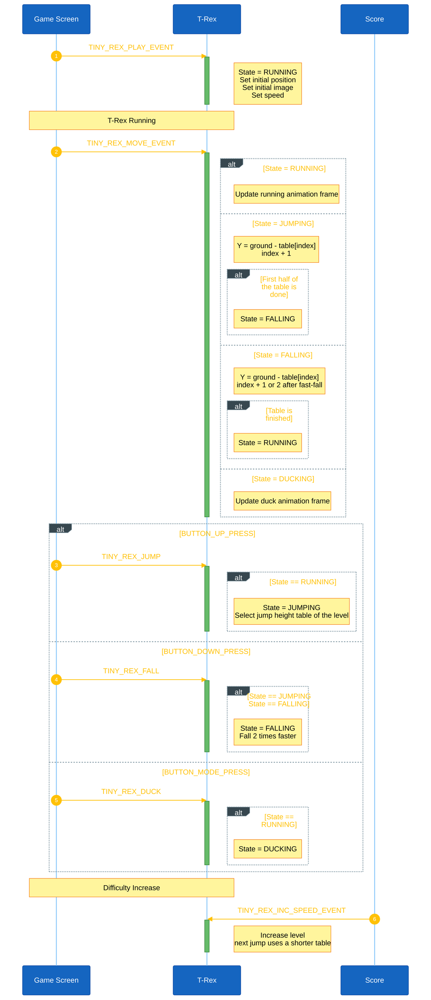
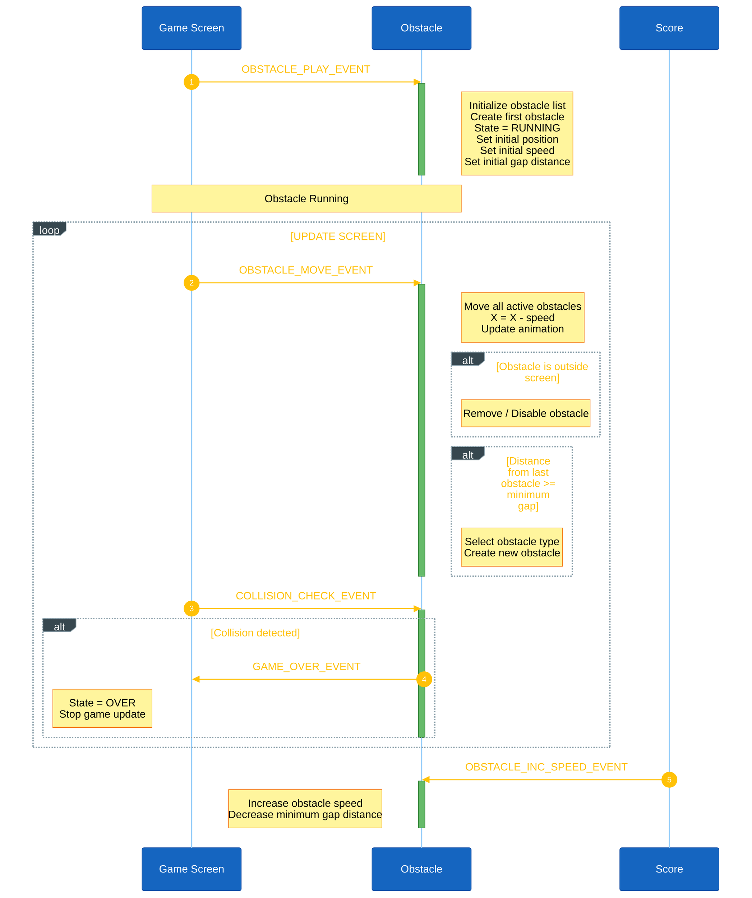
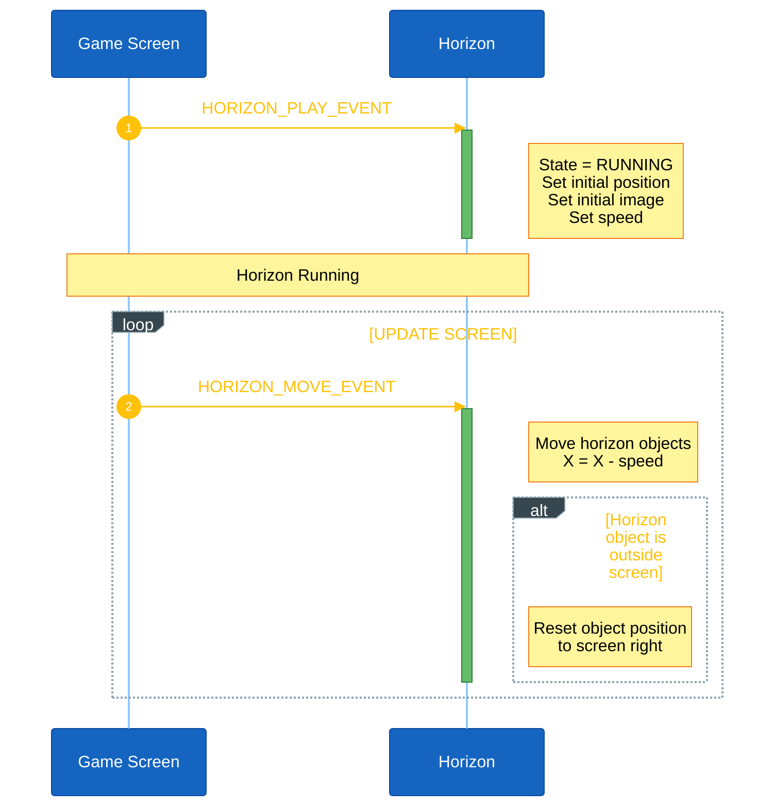
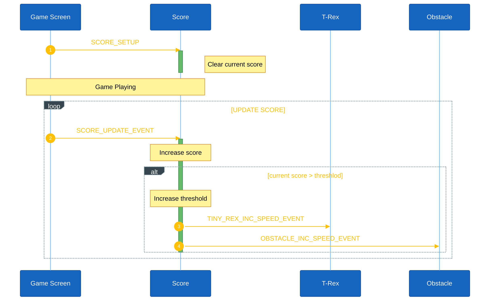

<h1 align="center">Game Object Sequences</h1>

This document describes the runtime sequence of objects in game. Each object which have own AK task for receive and handle signals from the screen task (scr_play.c) such as button callbacks, the periodic game tick timer...

## I. Object Summary

| Object | Task ID | Handler | Main responsibility |
|---|---|---|---|
| T-Rex | `TINY_REX_OBJECT_ID` | `tiny_rex_object_handle()` | Controls the player position, movement, and image state. |
| Obstacles | `OBSTACLE_OBJECT_ID` | `obstacle_object_handle()` | Controls obstacle spawning, movement, and collision with T-Rex. |
| Horizon | `HORIZON_OBJECT_ID` | `horizon_object_handle()` | Controls the background and horizon elements during gameplay. |

## II. T-Rex Object Sequence

The Game Screen controls the gameplay flow and sends events to the T-Rex object.

**Start-Play.** `TINY_REX_PLAY_EVENT` initializes the T-Rex with:

- `state = RUNNING`
- Initial position
- Initial image
- Initial speed

**Per-move tick.** Each `TINY_REX_MOVE_EVENT` updates the T-Rex according to its current state:

- `RUNNING`: Updates the running animation frame.
- `JUMPING`: Moves the T-Rex up. The height above the ground is read from the first half of the jump height table of the current level.
- `FALLING`: Moves the T-Rex down by reading the second half of the same table, until the table is finished and the T-Rex lands.
- `DUCKING`: Updates the duck animation frame.

**Button control.** The Game Screen sends control events directly to the T-Rex:

- `BUTTON_UP_PRESS` -> `TINY_REX_JUMP`
  - If `state == RUNNING`, changes the state to `JUMPING` and selects the jump height table of the current level.
- `BUTTON_DOWN_PRESS` -> `TINY_REX_FALL`
  - If `state == JUMPING` or `state == FALLING`, changes the state to `FALLING` and falls 2 times faster (2 table entries for each update). If the T-Rex is still going up it continues down from the same height, so it never goes higher after the button is pressed.
- `BUTTON_MODE_PRESS` -> `TINY_REX_DUCK`
  - If `state == RUNNING`, changes the state to `DUCKING`.

**Jump height tables.** There is one table for each level (`TINY_REX_JUMP_HEIGHT_L1` to `TINY_REX_JUMP_HEIGHT_L4` in `tiny_rex_object.cpp`). Every table goes up to the same top (36 pixels) and comes back down, one entry for each update (50ms). The higher the level, the faster the obstacles come, so the table is shorter (18, 13, 12 and 11 entries). The table is chosen when the jump starts and used for the whole jump.

**Difficulty increase.** The T-Rex starts at `L1`. `TINY_REX_INC_SPEED_EVENT` increases the level (up to `L4`), so the next jump uses a shorter jump height table. The Score handler sends this event every 200 points.

<strong><em>Figure 1:</em></strong> Tiny-Rex sequence logic

# III. Obstacles Object Sequence

The Game Screen controls the gameplay flow and sends events to the Obstacle object. The Obstacle object manages obstacle spawning, movement, spacing, and collision detection with the T-Rex.

**Start-Play.** `OBSTACLE_PLAY_EVENT` initializes the obstacle system with:

* Initialize the obstacle list.
* Create the first obstacle.
* `state = RUNNING`
* Set the initial position.
* Set the initial speed.
* Set the minimum gap between obstacles.

**Per-move tick.** Each `OBSTACLE_MOVE_EVENT` updates all active obstacles:

* Moves obstacles from right to left:
  `X = X - speed`
* Updates the obstacle animation.
* Removes or disables obstacles that move outside the screen.
* Creates a new obstacle when the distance from the previous obstacle reaches the minimum gap.
* Selects the obstacle type when creating a new obstacle.

**Collision detection.** `COLLISION_CHECK_EVENT` checks whether any active obstacle collides with the T-Rex.

* If a collision is detected, the Obstacle object sends `GAME_OVER_EVENT` to the Game Screen.
* The Game Screen changes to the `OVER` state and stops the game update.

**Difficulty increase.** `OBSTACLE_INC_SPEED_EVENT` increases the obstacle speed and reduces the minimum gap distance, making the game progressively more difficult.

# IV. Horizon Object Sequence

The Game Screen controls the gameplay flow and sends events to the Horizon object. The Horizon object manages the movement and recycling of background horizon elements to create a continuous scrolling effect.

**Start-Play.** `HORIZON_PLAY_EVENT` initializes the Horizon object with:

* `state = RUNNING`
* Initial position
* Initial image
* Initial speed

**Per-move tick.** Each `HORIZON_MOVE_EVENT` updates the Horizon objects:

* Moves the horizon objects from right to left:
  `X = X - speed`
* When a horizon object moves outside the screen, its position is reset to the right side of the screen so it can re-enter the gameplay area.

**Continuous scrolling.** The Horizon object continuously moves and recycles its elements while the game is running, creating the scrolling background effect.

# V. Score Sequence

The Game Screen controls the gameplay flow and sends events to the Score handler. The Score handler manages the score, update highest score from memory and difficult level.

**Start-Play.** `SCORE_SETUP` initializes the Score handler to default:

* Clear Current score

**Per-move tick.** Each `SCORE_UPDATE` updates the score and it will compare with score threshold for increase difficult level. The threshold starts at 200 points and goes up by 200 every time it is reached (200, 400, 600 ...). When difficult level increase, It will send event to object for increase velocity.
* Score -> T-Rex: `TINY_REX_INC_SPEED_EVENT`
* Score -> Obstacles: `OBSTACLE_INC_SPEED_EVENT`

**Game Over** `GAME_OVER_EVENT` It will save current socre. If current socre exceed highest score then it save score to memroy. And display GAME OVER icon

## V. Code References

| Object   | Source file                                            | Header file                                          |
| -------- | ------------------------------------------------------ | ---------------------------------------------------- |
| T-Rex    | `application/sources/app/tiny_rex/tiny_rex_object.cpp` | `application/sources/app/tiny_rex/tiny_rex_object.h` |
| Obstacle | `application/sources/app/obstacle/obstacle_object.cpp` | `application/sources/app/obstacle/obstacle_object.h` |
| Horizon  | `application/sources/app/horizon/horizon_object.cpp`   | `application/sources/app/horizon/horizon_object.h`   |
| Scire    | `application/sources/app/horizon/score.cpp`            | `application/sources/app/horizon/score.h`             |