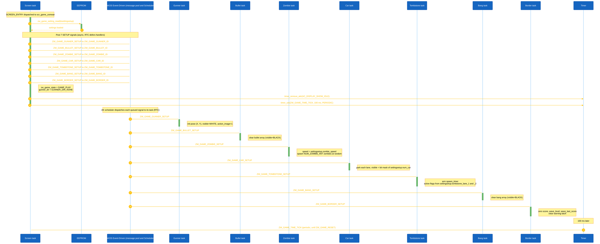
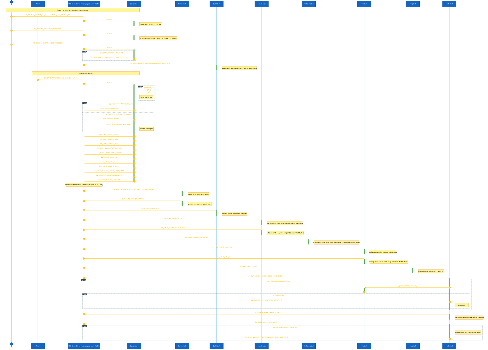
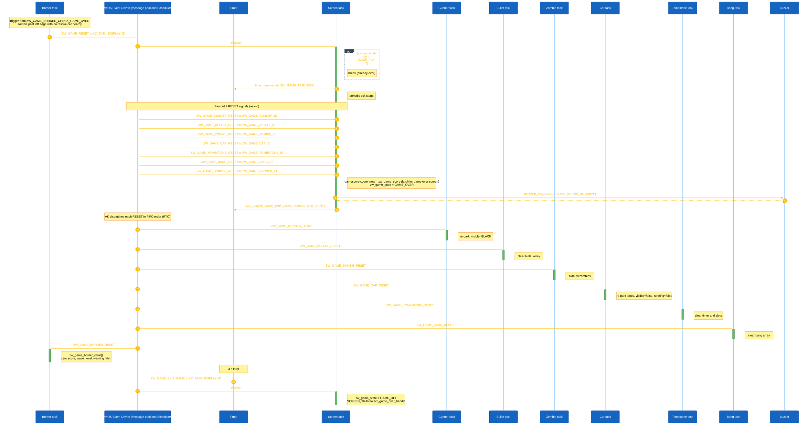

<h1 align="center">Runtime Signal Processing</h1>

This document explains how the Zomwar Game processes button input, task messages, game-loop ticks, and object updates. The game uses the AK event-driven task architecture: each major game object owns a task, receives signals through AK messages, and updates its own state.

## I. Overview

The Zomwar Game is implemented using event-driven tasks.

Each game object owns:

- A dedicated task
- Its own signal handler
- Its own state data
- Its own update logic

The display task (`AC_TASK_DISPLAY_ID`) owns the screen manager and handles screen-level events. During gameplay the active screen `scr_game_zomwar` receives the periodic game tick and posts update messages for each game-object task.

Input events from hardware buttons are converted into software signals. Button callbacks always post `AC_DISPLAY_BUTTON_*` signals to `AC_TASK_DISPLAY_ID`; the active screen handler decides what to do with them. During gameplay the screen translates UP/DOWN into a latched `gunner_dir` and translates MODE_PRESSED into `ZW_GAME_BULLET_SHOOT`.

The main game loop is driven by a periodic timer signal:

```c
ZW_GAME_TIME_TICK
```

The current game tick interval is:

```c
ZW_GAME_TIME_TICK_INTERVAL = 100 ms
```

Main runtime flow:

1. Button callbacks or timers create software signals.
2. Signals are posted into the AK message pool.
3. The AK scheduler dispatches messages to destination task handlers.
4. Each task updates only the state it owns.
5. The screen render reads the latest object state and refreshes the display buffer.

### High Level Architecture

#### 1. Game Start



<p align="center"><strong><em>Figure 1:</em></strong> Game start sequence logic</p>

#### 2. Game Playing



<p align="center"><strong><em>Figure 2:</em></strong> Gameplay sequence logic</p>

#### 3. Game Reset



<p align="center"><strong><em>Figure 3:</em></strong> Game reset sequence logic</p>

## II. Code References

| Area | File |
|---|---|
| Task IDs and task handlers | `application/sources/app/task_list.h` |
| Task table registration | `application/sources/app/task_list.cpp` |
| Signal definitions | `application/sources/app/app.h` |
| Button callback logic | `application/sources/app/app_bsp.cpp` |
| Main game screen logic | `application/sources/app/screens/scr_game_zomwar.cpp` |
| Game-over screen logic | `application/sources/app/screens/scr_game_over.cpp` |
| Screen manager | `application/sources/common/screen_manager.cpp` |

## III. Task Ownership

| Task | Responsibility | Owns Data | Receives Signals |
|---|---|---|---|
| `AC_TASK_DISPLAY_ID` | Screen manager, render scheduling, button routing, central game-tick dispatch | Current screen state, `zw_game_state`, `gunner_dir`, `gamescore` | All `AC_DISPLAY_*` button signals, `ZW_GAME_TIME_TICK`, `ZW_GAME_RESET`, `ZW_GAME_EXIT_GAME` |
| `ZW_GAME_GUNNER_ID` | Player control | `gunner`, internal `gunner_y` | `ZW_GAME_GUNNER_SETUP`, `ZW_GAME_GUNNER_UPDATE`, `ZW_GAME_GUNNER_UP`, `ZW_GAME_GUNNER_DOWN`, `ZW_GAME_GUNNER_RESET` |
| `ZW_GAME_BULLET_ID` | Bullet movement and shooting | `bullet[]` | `ZW_GAME_BULLET_SETUP`, `ZW_GAME_BULLET_RUN`, `ZW_GAME_BULLET_SHOOT`, `ZW_GAME_BULLET_RESET` |
| `ZW_GAME_ZOMBIE_ID` | Zombie movement, collision, wave spawn, menu demo | `zombie[]`, `zw_game_zombie_speed` | `ZW_GAME_ZOMBIE_SETUP`, `ZW_GAME_ZOMBIE_RUN`, `ZW_GAME_ZOMBIE_DETONATOR`, `ZW_GAME_ZOMBIE_WAVE_SPAWN`, `ZW_GAME_ZOMBIE_RESET`, `ZW_GAME_ZOMBIE_SETUP_MENU`, `ZW_GAME_ZOMBIE_RUN_MENU` |
| `ZW_GAME_CAR_ID` | Lawnmower rescue logic | `car[]` | `ZW_GAME_CAR_SETUP`, `ZW_GAME_CAR_RUN`, `ZW_GAME_CAR_HIT`, `ZW_GAME_CAR_RESET` |
| `ZW_GAME_TOMBSTONE_ID` | Tombstone spawn timing | `tombstone[]`, `tombstone_spawn_timer` | `ZW_GAME_TOMBSTONE_SETUP`, `ZW_GAME_TOMBSTONE_SPAWN`, `ZW_GAME_TOMBSTONE_RESET` |
| `ZW_GAME_BANG_ID` | Explosion animation | `bang[]` | `ZW_GAME_BANG_SETUP`, `ZW_GAME_BANG_UPDATE`, `ZW_GAME_BANG_RESET` |
| `ZW_GAME_BORDER_ID` | Wave / level-up / game-over detection | `zw_game_score`, `wave_last_score`, `wave_level`, `wave_warning_active`, `wave_warning_timer` | `ZW_GAME_BORDER_SETUP`, `ZW_GAME_BORDER_CHECK_GAME_OVER`, `ZW_GAME_BORDER_CHECK_WAVE`, `ZW_GAME_BORDER_LEVEL_UP`, `ZW_GAME_BORDER_RESET` |

## IV. Button Event Processing

In Zomwar, button callbacks always post `AC_DISPLAY_BUTTON_*` signals to `AC_TASK_DISPLAY_ID`. The currently active screen handler then decides what to do with them. The Zomwar gameplay screen (`scr_game_zomwar`) handles those signals locally; it does not require the BSP to know which screen is active.

### Button Processing Rules

| Button | BSP posts to AK | Active screen | Result inside the screen handler |
|---|---|---|---|
| MODE Pressed | `AC_DISPLAY_BUTTON_MODE_PRESSED` → `AC_TASK_DISPLAY_ID` | `scr_game_zomwar` | If `zw_game_state == GAME_PLAY`: post `ZW_GAME_BULLET_SHOOT` to `ZW_GAME_BULLET_ID` |
| UP Pressed | `AC_DISPLAY_BUTTON_UP_PRESSED` → `AC_TASK_DISPLAY_ID` | `scr_game_zomwar` | `gunner_dir = GUNNER_DIR_UP` (no message posted) |
| UP Released | `AC_DISPLAY_BUTTON_UP_RELEASED` → `AC_TASK_DISPLAY_ID` | `scr_game_zomwar` | If `gunner_dir == GUNNER_DIR_UP`: `gunner_dir = GUNNER_DIR_NONE` |
| DOWN Pressed | `AC_DISPLAY_BUTTON_DOWN_PRESSED` → `AC_TASK_DISPLAY_ID` | `scr_game_zomwar` | `gunner_dir = GUNNER_DIR_DOWN` (no message posted) |
| DOWN Released | `AC_DISPLAY_BUTTON_DOWN_RELEASED` → `AC_TASK_DISPLAY_ID` | `scr_game_zomwar` | If `gunner_dir == GUNNER_DIR_DOWN`: `gunner_dir = GUNNER_DIR_NONE` |

Note: the BSP's MODE callback only posts on `BUTTON_SW_STATE_PRESSED`; there is no `MODE_RELEASED` event. The actual `ZW_GAME_GUNNER_UP`/`DOWN` signals are posted by the screen on every `ZW_GAME_TIME_TICK` based on the latched `gunner_dir`, not by the button callback directly.

## V. Runtime Scheduling Notes

The system uses asynchronous task-based scheduling.

Important runtime characteristics:

- Signals are queued in AK before they are handled.
- A sender posts a message; it does not directly execute the destination task handler.
- Handlers run to completion (RTC): a task processes one signal fully before pulling the next.
- Game logic is decoupled through signals.
- Timing depends on scheduler execution order.
- A signal may wait in the AK message pool before its handler executes.
- `ZW_GAME_TIME_TICK` can appear between button pressed and released logs because the timer keeps running.
- Bang has no spawn signal: Zombie's `ZW_GAME_ZOMBIE_DETONATOR` and Car's `ZW_GAME_CAR_RUN`/`ZW_GAME_CAR_HIT` call `zw_game_bang_spawn()` directly to write into `bang[]`. The Bang task only owns the per-tick animation (`ZW_GAME_BANG_UPDATE`).
- Border crosses task boundaries in two places: it posts `ZW_GAME_ZOMBIE_WAVE_SPAWN` to Zombie on `ZW_GAME_BORDER_LEVEL_UP` (async), and calls `zw_game_car_find_nearest()` synchronously into the Car module on `ZW_GAME_BORDER_CHECK_GAME_OVER` (sync helper, reads `car[]`).
- Tombstone writes into `zombie[]` via a synchronous helper `zw_game_zombie_spawn_from_tombstone()` during its own `ZW_GAME_TOMBSTONE_SPAWN` tick — it does not post a signal to the Zombie task.
- The game-over flow is split between two screens: `scr_game_zomwar` latches `gamescore.score_now`, plays `BUZZER_SOUND_GOODBYE`, and arms a one-shot `ZW_GAME_EXIT_GAME` timer; `scr_game_over` runs the ranking and writes the score to EEPROM only after the user presses Retry / Rank / Home.
