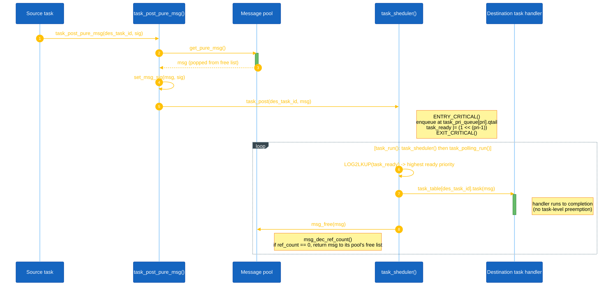
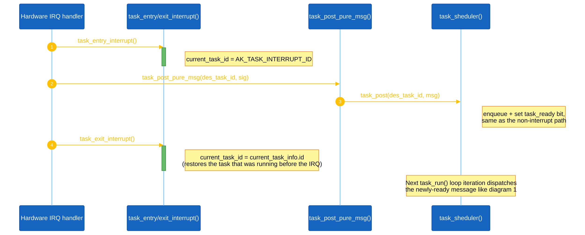
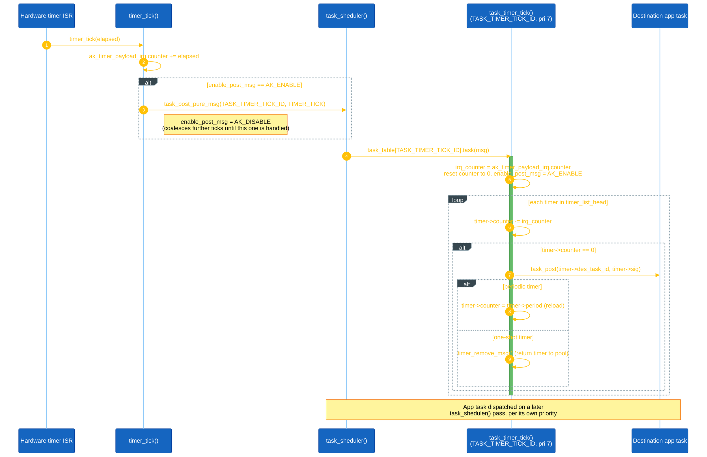

<h1 align="center">AK Kernel: Active-Object Scheduler</h1>

This document describes the "AK" kernel that all Tiny-Rex firmware runs on: a small, cooperative, priority-based active-object scheduler that lives in `application/sources/ak/`. It is the reusable engine underneath the game (and is intentionally **not** renamed to Tiny-Rex-specific naming, see [Section VII](#vii-scope-not-renamed-to-tiny-rex)) - every task, timer, and message described in [02-guide-coding-rules.md](02-guide-coding-rules.md) and [03-design-sequence-object.md](03-design-sequence-object.md) is built on top of the primitives explained here.

---

## Table of contents

- [I. Design lineage](#i-design-lineage)
- [II. Core concepts](#ii-core-concepts)
- [III. Task scheduler](#iii-task-scheduler)
- [IV. Messages](#iv-messages)
- [V. Timers](#v-timers)
- [VI. State machine helpers (FSM / TSM)](#vi-state-machine-helpers-fsm--tsm)
- [VII. Scope: not renamed to Tiny-Rex](#vii-scope-not-renamed-to-tiny-rex)
- [VIII. File map](#viii-file-map)
- [IX. Adding a new task](#ix-adding-a-new-task)

---

## I. Design lineage

The scheduler's own source comments credit the mechanism to `doc/Samek0607.pdf` (Miro Samek's "Practical Statecharts in C/C++" material on active objects). AK is a from-scratch embedded implementation of that pattern: a fixed, small set of **active objects** (tasks), each with its own priority and message queue, run by a single-threaded, non-preemptive (at the task level) scheduler that always executes the highest-priority task that has work pending, and runs each message handler to completion before picking the next one.

## II. Core concepts

| Concept | What it means in AK |
|---|---|
| **Active object / task** | A priority + a message queue + a handler function (`pf_task`, `void (*)(ak_msg_t*)`). Tasks never call each other directly; they only communicate by posting messages. |
| **Signal** | A `uint8_t` tag (`msg->sig`) identifying what a message means to its destination task. Signal ranges are namespaced by `#define`s anchoring per-domain enums: `AK_SYS_DEFINE_SIG` (kernel), `AK_USER_DEFINE_SIG` (app framework), `TINY_REX_DEFINE_SIG` (game). |
| **Message** | An `ak_msg_t` (or one of its three sized variants) carrying a signal from a source task to a destination task, allocated from a fixed-size static pool - there is no dynamic heap allocation on the message-passing path. |
| **Run-to-completion** | A task's handler always finishes before the scheduler looks at the next message. There is no task-level preemption; only hardware interrupts can interrupt a running handler. |
| **Polling task** | A plain function called once per idle scheduler pass (no message, no priority) - used for lightweight, always-on housekeeping rather than event-driven work. |

## III. Task scheduler

Implemented in `ak/src/task.c` / `ak/inc/task.h`.

- **Task table.** `task_create(app_task_table)` walks the app-provided array until it hits the `AK_TASK_EOT_ID` sentinel and records its length. Each row is `{task_id_t id, task_pri_t pri, pf_task task}`. Task IDs **must** be declared in increasing order (`task_list.h`), and priorities run `TASK_PRI_LEVEL_0` (lowest) to `TASK_PRI_LEVEL_7` (highest, reserved for `TASK_TIMER_TICK_ID`).
- **Per-priority queues.** There are exactly `TASK_PRI_MAX_SIZE` (8) FIFO queues, one per priority level, held in `task_pri_queue[]`. Posting a message (`task_post`) appends it to the queue for the destination task's priority and sets that priority's bit in the 8-bit `task_ready` bitmask.
- **Scheduling.** `task_sheduler()` uses `LOG2LKUP(task_ready)` (a `__builtin_clz`-based highest-set-bit lookup, see `platform/stm32l/platform.h`) to jump straight to the highest ready priority, pop one message, and call `task_table[msg->des_task_id].task(msg)`. It loops until no priority higher than the one it started at still has work, then returns to `task_run()`'s `for(;;)` loop, which alternates scheduling with `task_polling_run()`.
- **Posting helpers.** `task_post_pure_msg`, `task_post_common_msg`, `task_post_dynamic_msg` allocate the matching message type, set the signal, and post in one call; `task_post` is the primitive they build on.
- **Cancelling.** `task_remove_msg(task_id, sig)` walks a task's pending queue and force-frees any matching, not-yet-handled messages (used by `timer_remove_attr` to cancel a timer's in-flight signal along with the timer itself).
- **Interrupts.** Every ISR that touches the kernel (post messages, kick timers) must bracket its work with `task_entry_interrupt()` / `task_exit_interrupt()`, which mark `current_task_id` as `AK_TASK_INTERRUPT_ID` for the duration and (optionally) log the exception. `ENTRY_CRITICAL()` / `EXIT_CRITICAL()` (also `platform/stm32l/platform.h`) guard every shared-state access inside the kernel itself.
- **Polling tasks.** A second, much simpler table (`app_task_polling_table`, terminated by `AK_TASK_POLLING_EOT_ID`) lists plain no-argument functions that `task_polling_run()` calls every idle pass when their `ability` flag is `AK_ENABLE` (toggle at runtime with `task_polling_set_ability`).

### Sequence diagrams

The three flows below are transcribed directly from `ak/src/task.c` and `ak/src/timer.c` (function names and call order match the real source, not a simplified summary).

**1. A task posts a message to another task, and the scheduler dispatches it.**

**2. A hardware interrupt posts a message (must bracket kernel calls).**

**3. A hardware tick drives software timers, which post signals to app tasks.**

## IV. Messages

Implemented in `ak/src/message.c` / `ak/inc/message.h`.

Every message starts with the same private header (`ak_msg_t`): a `next` pointer for its intrusive queue/pool linked list, kernel bookkeeping (`src_task_id`, `des_task_id`, `ref_count`, `sig`), optional debug timing (`dbg_handler_t`, gated by `AK_TASK_DEBUG`), and a second, "public" header (`if_src_task_id`, `if_des_task_id`, `if_src_type`, `if_des_type`, `if_sig`) that application code is free to use for its own external-interface bookkeeping.

Three fixed-size static pools exist, sized at build time and never grown at runtime:

| Type | Struct | Pool size macro | Carries |
|---|---|---|---|
| Pure | `ak_msg_pure_t` | `AK_PURE_MSG_POOL_SIZE` (32) | Just the header - signal only, no payload. |
| Common | `ak_msg_common_t` | `AK_COMMON_MSG_POOL_SIZE` (8) | A fixed `AK_COMMON_MSG_DATA_SIZE` (64) byte inline buffer (`set_data_common_msg`/`get_data_common_msg`). |
| Dynamic | `ak_msg_dynamic_t` | `AK_DYNAMIC_MSG_POOL_SIZE` (8) | A variable-length buffer backed by its own linked pool of data units (`set_data_dynamic_msg`/`get_data_dynamic_msg`). |

Each pool is a simple free-list of static array slots (`get_pure_msg`/`get_common_msg`/`get_dynamic_msg` pop the free list; the matching `free_*_msg` push back onto it), so allocation is O(1) and never fails silently - exhausting a pool calls `FATAL(...)` rather than returning null.

Messages are reference-counted (`ref_count`, max `AK_MSG_REF_COUNT_MAX` = 7): `msg_inc_ref_count`/`msg_dec_ref_count` adjust it, and `msg_free()` (called by the scheduler after every handler returns) only actually returns the message to its pool once the count reaches zero. This lets one message be fanned out to several destinations (bump the ref count once per extra recipient) without copying it. `msg_force_free()` bypasses the ref count entirely and is used when a message must be reclaimed immediately (e.g. cancelling a pending post in `task_remove_msg`).

## V. Timers

Implemented in `ak/src/timer.c` / `ak/inc/timer.h`.

Software timers (`ak_timer_t`) are a singly linked list (`timer_list_head`), allocated from their own fixed pool (`AK_TIMER_POOL_SIZE` = 16). `timer_set(des_task_id, sig, duty, type)` either updates an existing timer for that `(task, signal)` pair or allocates a new one; `type` is `TIMER_ONE_SHOT` (fires once, then is freed) or `TIMER_PERIODIC` (reloads `counter` from `period` and keeps running). `timer_remove_attr` cancels a timer and, via `timer_remove_msg` + `task_remove_msg`, also strips out its signal if it had already fired and was sitting in a task's queue.

A hardware tick (typically a 1ms/10ms interrupt) calls `timer_tick(elapsed)`, which accumulates elapsed ticks and posts a single `TIMER_TICK` pure message to `TASK_TIMER_TICK_ID` - the **highest-priority** task in the system (`TASK_PRI_LEVEL_7`), so timer bookkeeping is never starved by game logic. That task's handler, `task_timer_tick()`, walks the active timer list once per tick batch, decrements every counter by the accumulated elapsed time, and for each timer that reaches zero posts `sig` to `des_task_id` (rescheduling periodic timers, freeing one-shot ones).

## VI. State machine helpers (FSM / TSM)

Two lightweight, optional helpers sit above the raw task/message primitives for tasks that want an explicit state machine instead of a flat `switch` on `msg->sig`:

- **`fsm.h`/`fsm.c`** - a state is just a function pointer (`state_handler`). `FSM(me, init_func)` sets the initial state, `FSM_TRAN(me, target)` transitions by reassigning the pointer, and `fsm_dispatch(me, msg)` simply calls `me->state(msg)`. Minimal overhead, but the state's own code decides what to do with unhandled signals.
- **`tsm.h`/`tsm.c`** - a table-driven state machine: each state is an array of `{sig, next_state, tsm_func}` rows terminated by `TSM_NULL_MSG`. `tsm_dispatch` looks up the row matching `msg->sig` in the current state's table, transitions to `next_state` if it differs from the current state, and calls `tsm_func` if set. This makes the full transition table visible at a glance instead of scattered across `case` labels.

Neither is mandatory. In this project all four game objects in `app/tiny_rex_game/` are driven by `tsm`, one table per state, each row mapping a signal to a next state and an action: `tiny_rex_object` (`RUNNING`/`JUMPING`/`FALLING`/`DUCKING`), `obstacles_object` (`RUNNING`/`COLLIDED`), and `horizon_object` and `score` (a single state each, so their table is just a signal-to-action map). `task_display`/`scr_*` route through `screen_manager`'s own dispatch instead, and `fsm` has no user.

## VII. Scope: not renamed to Tiny-Rex

`application/sources/ak/` is treated as a vendored, reusable engine, conceptually shared with the `boot/` bootloader project and the upstream AK Embedded Base Kit that this repository was forked from. When the app layer was cleaned up and renamed to Tiny-Rex-specific naming (see [CLAUDE.md](../../CLAUDE.md)), this kernel folder and its `AK_*`/`ak_*` identifiers were deliberately left untouched. Two identifiers are worth calling out specifically because the kernel checks for them **by name**, not just by convention: `AK_TASK_EOT_ID` and `AK_TASK_POLLING_EOT_ID` are the exact sentinel values `ak/src/task.c` loops until in `task_create`/`task_polling_create` - renaming or reordering them in `task_list.h` would silently break task/polling-table initialization.

## VIII. File map

| File | Responsibility |
|---|---|
| `ak/inc/ak.h` | Kernel-wide constants: flags (`AK_ENABLE`/`AK_DISABLE`), return codes, signal-range anchors (`AK_SYS_DEFINE_SIG`, `AK_USER_DEFINE_SIG`, `TINY_REX_DEFINE_SIG`), priority levels, reserved task IDs. |
| `ak/inc/task.h`, `ak/src/task.c` | Task table, per-priority queues, scheduler loop, polling tasks, interrupt entry/exit bookkeeping. |
| `ak/inc/message.h`, `ak/src/message.c` | `ak_msg_t` and its pure/common/dynamic variants, the three static message pools, reference counting. |
| `ak/inc/timer.h`, `ak/src/timer.c` | Software timer list, one-shot/periodic timers, the tick-to-message bridge (`timer_tick` -> `TIMER_TICK` -> `task_timer_tick`). |
| `ak/inc/fsm.h`, `ak/src/fsm.c` | Minimal function-pointer state machine helper. |
| `ak/inc/tsm.h`, `ak/src/tsm.c` | Table-driven state machine helper. |
| `ak/inc/port.h` | Compiler/portability macros (`__AK_PACKETED`, `__AK_WEAK`) built on top of `platform.h`. |
| `ak/inc/ak_dbg.h` | Reserved for kernel debug macros (currently empty). |
| `ak/doc/Samek0607.pdf` | The active-object design reference the scheduler is modeled on. |

## IX. Adding a new task

1. Add the task's ID to the enum in `application/sources/app/task_list.h`, keeping IDs in increasing order and before `AK_TASK_EOT_ID`.
2. Declare its handler (`extern void my_task(ak_msg_t* msg);`) in the same header.
3. Register `{MY_TASK_ID, TASK_PRI_LEVEL_n, my_task}` in `app_task_table` in `task_list.cpp`, before the `AK_TASK_EOT_ID` sentinel row.
4. Define the task's signal enum in `app.h` (or its own header), anchored to `AK_USER_DEFINE_SIG` for app-framework tasks or `TINY_REX_DEFINE_SIG` for game objects.
5. Post to it with `task_post_pure_msg` / `task_post_common_msg` / `task_post_dynamic_msg`, or schedule it with `timer_set`.

See [02-guide-coding-rules.md](02-guide-coding-rules.md) for the naming conventions that apply to the new task ID, signals, and handler function.
